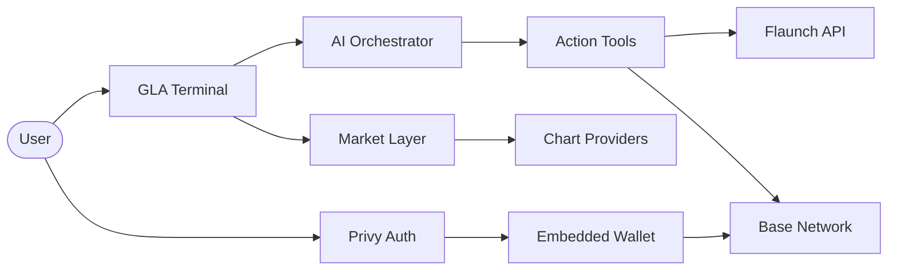

  

# GLaunch

**Launch tokens that keep moving while you build.**

[Terminal](https://glaunch.world/terminal) · [Market](https://glaunch.world/market) · [Documentation](docs/overview.md) · [Report Bug](https://github.com/Glaunchpad/Glaunch/issues/new?template=bug_report.yml) · [Request Feature](https://github.com/Glaunchpad/Glaunch/issues/new?template=feature_request.yml)

---

## Overview

**GLaunch** is an AI-powered launch desk on **Base**. Deploy tokens, scan markets, manage wallets, and track performance — all from a single conversational terminal powered by **GLA**, your on-chain launch assistant.

> This repository is the **public home** for GLaunch: product docs, community templates, and release notes.  
> **Application source code is not published here** to protect integrations, infrastructure, and launch logic.

---

## Features

| Module | Description |
|--------|-------------|
| **Terminal** | Chat with GLA to deploy tokens, transfer funds, claim earnings, and run market scans |
| **Market** | Browse trending launches, live charts, and token discovery on Base |
| **Wallet** | Privy-powered auth with embedded wallet, withdrawals, and royalty claims |
| **My Launches** | Dashboard for your Flaunch deployments and revenue |
| **PnL Analytics** | Portfolio and performance tracking across your positions |

### GLA — AI Launch Assistant

GLA handles the operational layer so you can focus on building:

- Natural-language token deploys via [Flaunch](https://flaunch.gg)
- Market scans, token search, and portfolio reads
- Wallet actions: transfer, claim, and on-chain execution
- Smart guardrails: daily deploy limits and cooldown enforcement

---

## Tech Stack

  
  
  
  
  
  
  

**Integrations:** [Flaunch](https://flaunch.gg) · [Privy](https://privy.io) · [DexScreener](https://dexscreener.com) · [GeckoTerminal](https://www.geckoterminal.com) · [CoinGecko](https://www.coingecko.com)

---

## Architecture

High-level flow — no proprietary implementation details:

See [docs/architecture.md](docs/architecture.md) for a deeper (still non-source) overview.

---

## Getting Started

GLaunch is a hosted product. There is **no public self-host bundle** in this repository.

1. Visit **[glaunch.world](https://glaunch.world/)**
2. Sign in with **Google**, **X**, or **Farcaster** via Privy
3. Open the **Terminal** and tell GLA what you want to launch

For environment and deployment concepts (reference only), see [docs/overview.md](docs/overview.md).

---

## Roadmap

- [x] AI terminal with deploy, transfer, and claim tools
- [x] Market discovery and live charts
- [x] Wallet dashboard and royalty claims
- [x] PnL analytics
- [ ] Public API for launch partners
- [ ] Mobile-optimized terminal
- [ ] Multi-chain expansion

Track progress in [CHANGELOG.md](CHANGELOG.md) and [GitHub Issues](https://github.com/Glaunchpad/Glaunch/issues).

---

## Community

We welcome bug reports, feature ideas, and documentation improvements. See [CONTRIBUTING.md](CONTRIBUTING.md).

---

## Security

Found a vulnerability? Please **do not** open a public issue. Read [SECURITY.md](SECURITY.md) for responsible disclosure.

---

## License

This repository is licensed under the [MIT License](LICENSE).

Application source, proprietary integrations, and production infrastructure are **not** included in this public repository.

---

**Built on Base** · Powered by **GLA**

 

GLaunch © 2026 Glaunchpad. All rights reserved.

